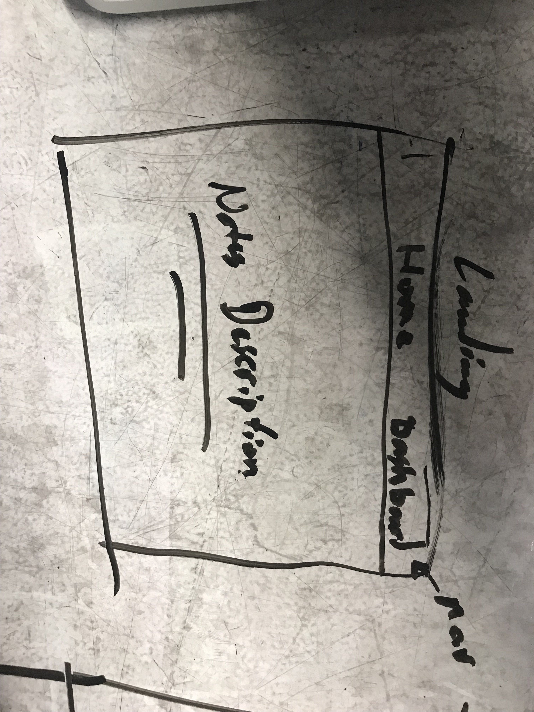
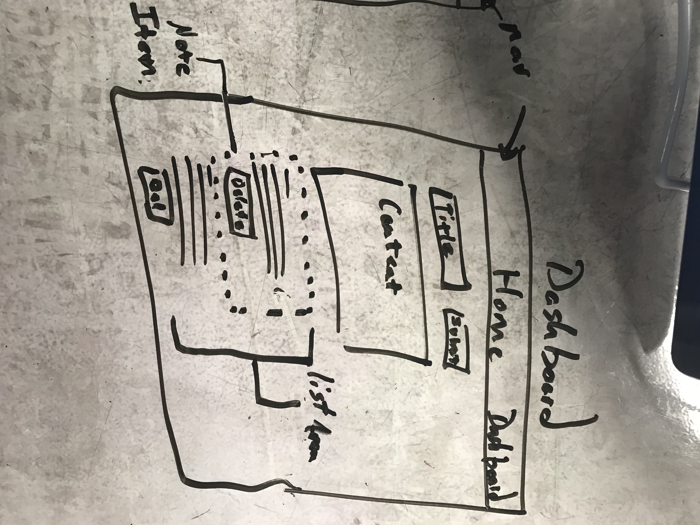

# LAB 28-29

**Author**: Joshua Fredrickson

**Version**: 2.0.0 

## Overview
Lab 28 is a note taking application that is locally is installed and ran through a browser. that 
is locally is installed and ran through a browser.

## How to use
To use the Lab 28 application, [Node.js](https://nodejs.org/en/)and [npm](https://www.npmjs.com/) 
(Node Package manager)will need
 to be locally installed.  Once Node.js and npm have been installed, install the Lab 28 files.  
 Prior to starting the Lab 28 application, from the command line while you are in the Lab 28 file 
 folder, enter the command `npm i`.  This will download all needed dependencies for the 
 application to run.   

##  Architecture 
This application was deployed with the following technologies along with the illlustrated structure.
Node.js, npm, dotenv, uuid, babel, superagent, 
http-errors, jest, eslint, JavaScript, enzyme, React

   

## Change Log
05-23-2018 3:35pm initial commit
05-23-2018 4:38pm finished scaffolding the lecture code
05-23-2018 4:51pm debugging lecture code
05-23-2018 4:57pm Lecture code is fully operational"
05-23-2018 6:02pm refactoring navBar and landing page
05-23-2018 6:13pm note items are populating but not in their own comp
05-23-2018 7:23pm refactoring expense into note
05-23-2018 10:18pm finished refactoring add note-form test
05-28-2018 1:44pm added Lab29 code.

Special thanks to all of the Code Fellows staff and fellow 401-d23 students.
